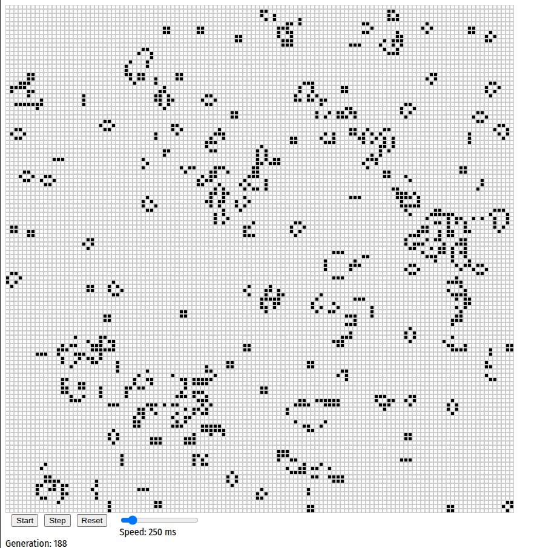

## Conways's Game of Life in Elm

I wanted to learn some Elm so I set out to create the Game of Life.

## Building it
Clone the repo locally and run `make init` to get the dependancies.
If you already have the dependancies installed you will see the output similar to below.
If you do not have these dependancies already installed then you will see it download and install them.

```bash
$ make init
elm install elm/time
It is already installed!
elm install elm/random
It is already installed!
```
When you have all the dependancies installed, you can build the program with `make`:
```bash
$ make
elm make src/Main.elm --output=main.js
Dependencies ready!
Success! Compiled 1 module.

    Main ───> main.js
```
The Elm compiler will create the `main.js` file from the `src/Main.elm` file.
There is a `index.html` file at the top-level that will load and initialize the new `main.js` file to start
the Elm Application running.

## Running the Game of Life in your browser
Use the command `make run` to launch the browser with the game
```bash
$ make run
```
this will launch a chromium browser with the `index.html` file.
You can also simply load the index file yourself if you don't use chromium:

#### On MacOS
```bash
$ open index.html
```

#### On Linux
```bash
$ xdg-open index.html
```

## Game controls
When the game is started, you will see a randomized 60x60 cell grid for the Game of Life, and a row of 3 buttons at the bottom, \[Start]\[Step]\[Reset].

Press the \[Start] button to start the game running. The \[Start] button will change to a \[Stop] button
to stop the game.

Similarly, the \[Reset] button is only available when the game is stopped, and it will reset the
Game of Life grid to a random placement of cells.   When the game is running, the \[Reset] buttons
will become a \[Restart] button.  Pressing this \[Restart] button will immediately Reset and Restart the game.

When the game is stopped, the \[Step] button will activate.  It is greyed out while the game is running.
You can use the \[Step] button to single step to the next generation.

The generation counter is at the bottom of the page.

## Cleaning up
The command `make clean` will remove any built files from the local repository.


## Screenshot

